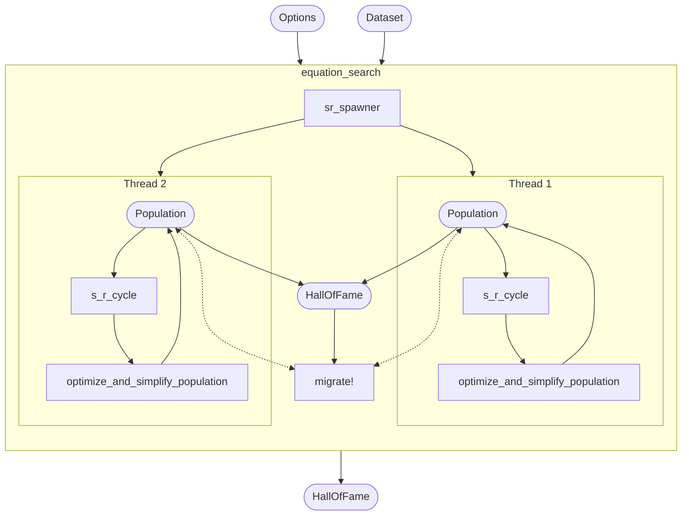

<!-- prettier-ignore-start -->
<div align="center">

SymbolicRegression.jl searches for symbolic expressions which optimize a particular objective.

https://github.com/MilesCranmer/SymbolicRegression.jl/assets/7593028/f5b68f1f-9830-497f-a197-6ae332c94ee0

<table>
<thead>
<tr>
<th align="center">Latest release</th>
<th align="center">Documentation</th>
<th align="center">Forums</th>
<th align="center">Paper</th>
</tr>
</thead>
<tbody>
<tr>
<td align="center"><a href="https://juliahub.com/ui/Packages/SymbolicRegression/X2eIS"></a></td>
<td align="center"><a href="https://ai.damtp.cam.ac.uk/symbolicregression/dev/"></a></td>
<td align="center"><a href="https://github.com/MilesCranmer/PySR/discussions"></a></td>
<td align="center"><a href="https://arxiv.org/abs/2305.01582"></a></td>
</tr>
<tr>
<td align="center"><strong>Build status</strong></td>
<td align="center"><strong>Coverage</strong></td>
<td align="center"></td>
<td align="center"></td>
</tr>
<tr>
<td align="center"><a href=".github/workflows/CI.yml"></a></td>
<td align="center"><a href="https://coveralls.io/github/MilesCranmer/SymbolicRegression.jl?branch=master"></a></td>
<td align="center"></td>
<td align="center"></td>
</tr>
</tbody>
</table>

Check out [PySR](https://github.com/MilesCranmer/PySR) for
a Python frontend.
[Cite this software](https://arxiv.org/abs/2305.01582)

</div>
<!-- prettier-ignore-end -->

**Contents**:

- [Quickstart](#quickstart)
  - [MLJ Interface](#mlj-interface)
  - [Low-Level Interface](#low-level-interface)
- [Constructing expressions](#constructing-expressions)
- [Exporting to SymbolicUtils.jl](#exporting-to-symbolicutilsjl)
- [Contributors ✨](#contributors-)
- [Code structure](#code-structure)
- [Search options](#search-options)

## Quickstart

Install in Julia with:

```julia
using Pkg
Pkg.add("SymbolicRegression")
```

### MLJ Interface

The easiest way to use SymbolicRegression.jl
is with [MLJ](https://github.com/alan-turing-institute/MLJ.jl).
Let's see an example:

```julia
import SymbolicRegression: SRRegressor
import MLJ: machine, fit!, predict, report

# Dataset with two named features:
X = (a = rand(500), b = rand(500))

# and one target:
y = @. 2 * cos(X.a * 23.5) - X.b ^ 2

# with some noise:
y = y .+ randn(500) .* 1e-3

model = SRRegressor(
    niterations=50,
    binary_operators=[+, -, *],
    unary_operators=[cos],
)
```

Now, let's create and train this model
on our data:

```julia
mach = machine(model, X, y)

fit!(mach)
```

You will notice that expressions are printed
using the column names of our table. If,
instead of a table-like object,
a simple array is passed
(e.g., `X=randn(100, 2)`),
`x1, ..., xn` will be used for variable names.

Let's look at the expressions discovered:

```julia
report(mach)
```

Finally, we can make predictions with the expressions
on new data:

```julia
predict(mach, X)
```

This will make predictions using the expression
selected by `model.selection_method`,
which by default is a mix of accuracy and complexity.

You can override this selection and select an equation from
the Pareto front manually with:

```julia
predict(mach, (data=X, idx=2))
```

where here we choose to evaluate the second equation.

For fitting multiple outputs, one can use `MultitargetSRRegressor`
(and pass an array of indices to `idx` in `predict` for selecting specific equations).
For a full list of options available to each regressor, see the [API page](https://ai.damtp.cam.ac.uk/symbolicregression/dev/api/).

### Low-Level Interface

The heart of SymbolicRegression.jl is the
`equation_search` function.
This takes a 2D array and attempts
to model a 1D array using analytic functional forms.
**Note:** unlike the MLJ interface,
this assumes column-major input of shape [features, rows].

```julia
import SymbolicRegression: Options, equation_search

X = randn(2, 100)
y = 2 * cos.(X[2, :]) + X[1, :] .^ 2 .- 2

options = Options(
    binary_operators=[+, *, /, -],
    unary_operators=[cos, exp],
    populations=20
)

hall_of_fame = equation_search(
    X, y, niterations=40, options=options,
    parallelism=:multithreading
)
```

You can view the resultant equations in the dominating Pareto front (best expression
seen at each complexity) with:

```julia
import SymbolicRegression: calculate_pareto_frontier

dominating = calculate_pareto_frontier(hall_of_fame)
```

This is a vector of `PopMember` type - which contains the expression along with the cost.
We can get the expressions with:

```julia
trees = [member.tree for member in dominating]
```

Each of these equations is an `Expression{T}` type for some constant type `T` (like `Float32`).

These expression objects are callable – you can simply pass in data:

```julia
tree = trees[end]
output = tree(X)
```


## Constructing expressions

Expressions are represented under-the-hood as the `Node` type which is developed
in the [DynamicExpressions.jl](https://github.com/SymbolicML/DynamicExpressions.jl/) package.
The `Expression` type wraps this and includes metadata about operators and variable names.

You can manipulate and construct expressions directly. For example:

```julia
using SymbolicRegression: Options, Expression, Node

options = Options(;
    binary_operators=[+, -, *, /], unary_operators=[cos, exp, sin]
)
operators = options.operators
variable_names = ["x1", "x2", "x3"]
x1, x2, x3 = [Expression(Node(Float64; feature=i); operators, variable_names) for i=1:3]

tree = cos(x1 - 3.2 * x2) - x1 * x1
```

This tree has `Float64` constants, so the type of the entire tree
will be promoted to `Node{Float64}`.

We can convert all constants (recursively) to `Float32`:

```julia
float32_tree = convert(Expression{Float32}, tree)
```

We can then evaluate this tree on a dataset:

```julia
X = rand(Float32, 3, 100)

tree(X)
```

This callable format is the easy-to-use version which will
automatically set all values to NaN if there were any
Inf or NaN during evaluation. You can call the raw evaluation
method with `eval_tree_array`:

```julia
output, did_succeed = eval_tree_array(tree, X)
```

where `did_succeed` explicitly declares whether the evaluation was successful.

## Exporting to SymbolicUtils.jl

We can view the equations in the dominating
Pareto frontier with:

```julia
dominating = calculate_pareto_frontier(hall_of_fame)
```

We can convert the best equation
to [SymbolicUtils.jl](https://github.com/JuliaSymbolics/SymbolicUtils.jl)
with the following function:

```julia
import SymbolicRegression: node_to_symbolic

eqn = node_to_symbolic(dominating[end].tree)
println(simplify(eqn*5 + 3))
```

We can also print out the full pareto frontier like so:

```julia
import SymbolicRegression: compute_complexity, string_tree

println("Complexity\tMSE\tEquation")

for member in dominating
    complexity = compute_complexity(member, options)
    loss = member.loss
    string = string_tree(member.tree, options)

    println("$(complexity)\t$(loss)\t$(string)")
end
```

## Contributors ✨

We are eager to welcome new contributors!
If you have an idea for a new feature, don't hesitate to share it on the [issues](https://github.com/MilesCranmer/SymbolicRegression.jl/issues) page or [forums](https://github.com/MilesCranmer/PySR/discussions).

<!-- ALL-CONTRIBUTORS-LIST:START - Do not remove or modify this section -->
<!-- prettier-ignore-start -->
<!-- markdownlint-disable -->
<table>
  <tbody>
    <tr>
      <td align="center" valign="top" width="12.5%"><a href="https://github.com/adil-soubki"><br /><sub><b>Adil</b></sub></a></td>
      <td align="center" valign="top" width="12.5%"><a href="https://cjdoris.github.io/"><br /><sub><b>Christopher Rowley</b></sub></a></td>
      <td align="center" valign="top" width="12.5%"><a href="https://www.linkedin.com/in/markkittisopikul/"><br /><sub><b>Mark Kittisopikul</b></sub></a></td>
      <td align="center" valign="top" width="12.5%"><a href="https://github.com/tttc3"><br /><sub><b>T Coxon</b></sub></a></td>
      <td align="center" valign="top" width="12.5%"><a href="https://github.com/DhananjayAshok"><br /><sub><b>Dhananjay Ashok</b></sub></a></td>
      <td align="center" valign="top" width="12.5%"><a href="https://gitlab.com/johanbluecreek"><br /><sub><b>Johan Blåbäck</b></sub></a></td>
      <td align="center" valign="top" width="12.5%"><a href="https://mathopt.de/people/martensen/index.php"><br /><sub><b>JuliusMartensen</b></sub></a></td>
      <td align="center" valign="top" width="12.5%"><a href="https://github.com/ngam"><br /><sub><b>ngam</b></sub></a></td>
    </tr>
    <tr>
      <td align="center" valign="top" width="12.5%"><a href="https://github.com/kazewong"><br /><sub><b>Kaze Wong</b></sub></a></td>
      <td align="center" valign="top" width="12.5%"><a href="https://github.com/ChrisRackauckas"><br /><sub><b>Christopher Rackauckas</b></sub></a></td>
      <td align="center" valign="top" width="12.5%"><a href="https://kidger.site/"><br /><sub><b>Patrick Kidger</b></sub></a></td>
      <td align="center" valign="top" width="12.5%"><a href="https://github.com/OkonSamuel"><br /><sub><b>Okon Samuel</b></sub></a></td>
      <td align="center" valign="top" width="12.5%"><a href="https://github.com/w2ll2am"><br /><sub><b>William Booth-Clibborn</b></sub></a></td>
      <td align="center" valign="top" width="12.5%"><a href="https://github.com/ayagh19"><br /><sub><b>Aya Ghaleb</b></sub></a></td>
      <td align="center" valign="top" width="12.5%"><a href="https://github.com/gca30"><br /><sub><b>gca30</b></sub></a></td>
      <td align="center" valign="top" width="12.5%"><a href="https://github.com/nmheim"><br /><sub><b>Niklas Heim</b></sub></a></td>
    </tr>
    <tr>
      <td align="center" valign="top" width="12.5%"><a href="https://github.com/atharvas"><br /><sub><b>Atharva Sehgal</b></sub></a></td>
      <td align="center" valign="top" width="12.5%"><a href="https://github.com/wkharold"><br /><sub><b>wkharold</b></sub></a></td>
      <td align="center" valign="top" width="12.5%"><a href="https://wsmoses.com"><br /><sub><b>William Moses</b></sub></a></td>
      <td align="center" valign="top" width="12.5%"><a href="https://grezde.github.io"><br /><sub><b>Ardeleanu Cristian</b></sub></a></td>
      <td align="center" valign="top" width="12.5%"><a href="https://github.com/gm89uk"><br /><sub><b>gm89uk</b></sub></a></td>
      <td align="center" valign="top" width="12.5%"><a href="https://pablo-lemos.github.io/"><br /><sub><b>Pablo Lemos</b></sub></a></td>
      <td align="center" valign="top" width="12.5%"><a href="https://github.com/Moelf"><br /><sub><b>Jerry Ling</b></sub></a></td>
      <td align="center" valign="top" width="12.5%"><a href="https://github.com/CharFox1"><br /><sub><b>Charles Fox</b></sub></a></td>
    </tr>
    <tr>
      <td align="center" valign="top" width="12.5%"><a href="https://github.com/johannbrehmer"><br /><sub><b>Johann Brehmer</b></sub></a></td>
      <td align="center" valign="top" width="12.5%"><a href="http://www.cosmicmar.com/"><br /><sub><b>Marius Millea</b></sub></a></td>
      <td align="center" valign="top" width="12.5%"><a href="https://gitlab.com/cobac"><br /><sub><b>Coba</b></sub></a></td>
      <td align="center" valign="top" width="12.5%"><a href="https://github.com/foxtran"><br /><sub><b>foxtran</b></sub></a></td>
      <td align="center" valign="top" width="12.5%"><a href="https://smhasan.com/"><br /><sub><b>Shah Mahdi Hasan </b></sub></a></td>
      <td align="center" valign="top" width="12.5%"><a href="https://aluthge.com"><br /><sub><b>Dilum Aluthge</b></sub></a></td>
      <td align="center" valign="top" width="12.5%"><a href="https://github.com/SebastianM-C"><br /><sub><b>Sebastian Micluța-Câmpeanu</b></sub></a></td>
      <td align="center" valign="top" width="12.5%"><a href="https://neuroscience.wustl.edu/people/timothy-holy-phd/"><br /><sub><b>Tim Holy</b></sub></a></td>
    </tr>
    <tr>
      <td align="center" valign="top" width="12.5%"><a href="https://github.com/BrotherHa"><br /><sub><b>BrotherHa</b></sub></a></td>
      <td align="center" valign="top" width="12.5%"><a href="https://wthompson.space"><br /><sub><b>William Thompson</b></sub></a></td>
      <td align="center" valign="top" width="12.5%"><a href="https://abzu.ai"><br /><sub><b>Tom Jelen</b></sub></a></td>
      <td align="center" valign="top" width="12.5%"><a href="https://www.miguelromao.me/"><br /><sub><b>Miguel Crispim Romao</b></sub></a></td>
      <td align="center" valign="top" width="12.5%"><a href="https://github.com/adienes"><br /><sub><b>Andy Dienes</b></sub></a></td>
      <td align="center" valign="top" width="12.5%"><a href="https://singhharsh.in"><br /><sub><b>Harsh Singh </b></sub></a></td>
      <td align="center" valign="top" width="12.5%"><a href="https://github.com/pitmonticone"><br /><sub><b>Pietro Monticone</b></sub></a></td>
      <td align="center" valign="top" width="12.5%"><a href="https://github.com/sheevy"><br /><sub><b>Mateusz Kubica</b></sub></a></td>
    </tr>
    <tr>
      <td align="center" valign="top" width="12.5%"><a href="https://github.com/WilliamBC-SL"><br /><sub><b>William Booth-Clibborn</b></sub></a></td>
      <td align="center" valign="top" width="12.5%"><a href="https://raulpl.github.io/about"><br /><sub><b>Raúl Peralta Lozada</b></sub></a></td>
      <td align="center" valign="top" width="12.5%"><a href="https://www.linkedin.com/in/hvaara/"><br /><sub><b>Roy Hvaara</b></sub></a></td>
      <td align="center" valign="top" width="12.5%"><a href="https://github.com/VishalJ99"><br /><sub><b>Vishal Jain</b></sub></a></td>
      <td align="center" valign="top" width="12.5%"><a href="https://github.com/spaette"><br /><sub><b>spaette</b></sub></a></td>
      <td align="center" valign="top" width="12.5%"><a href="http://www.yxliu.group"><br /><sub><b>Yi-Xin Liu</b></sub></a></td>
      <td align="center" valign="top" width="12.5%"><a href="https://github.com/spinnau"><br /><sub><b>spinnau</b></sub></a></td>
      <td align="center" valign="top" width="12.5%"><a href="https://github.com/sunxd3"><br /><sub><b>Xianda Sun</b></sub></a></td>
    </tr>
    <tr>
      <td align="center" valign="top" width="12.5%"><a href="https://jaywadekar.github.io/"><br /><sub><b>Jay Wadekar</b></sub></a></td>
      <td align="center" valign="top" width="12.5%"><a href="https://github.com/ablaom"><br /><sub><b>Anthony Blaom, PhD</b></sub></a></td>
      <td align="center" valign="top" width="12.5%"><a href="https://github.com/Jgmedina95"><br /><sub><b>Jgmedina95</b></sub></a></td>
      <td align="center" valign="top" width="12.5%"><a href="https://github.com/mcabbott"><br /><sub><b>Michael Abbott</b></sub></a></td>
      <td align="center" valign="top" width="12.5%"><a href="https://github.com/oscardssmith"><br /><sub><b>Oscar Smith</b></sub></a></td>
      <td align="center" valign="top" width="12.5%"><a href="https://ericphanson.com/"><br /><sub><b>Eric Hanson</b></sub></a></td>
      <td align="center" valign="top" width="12.5%"><a href="https://github.com/henriquebecker91"><br /><sub><b>Henrique Becker</b></sub></a></td>
      <td align="center" valign="top" width="12.5%"><a href="https://github.com/qwertyjl"><br /><sub><b>qwertyjl</b></sub></a></td>
    </tr>
    <tr>
      <td align="center" valign="top" width="12.5%"><a href="https://huijzer.xyz/"><br /><sub><b>Rik Huijzer</b></sub></a></td>
      <td align="center" valign="top" width="12.5%"><a href="https://github.com/GCaptainNemo"><br /><sub><b>Hongyu Wang</b></sub></a></td>
      <td align="center" valign="top" width="12.5%"><a href="https://github.com/ZehaoJin"><br /><sub><b>Zehao Jin</b></sub></a></td>
      <td align="center" valign="top" width="12.5%"><a href="https://github.com/tmengel"><br /><sub><b>Tanner Mengel</b></sub></a></td>
      <td align="center" valign="top" width="12.5%"><a href="https://github.com/agrundner24"><br /><sub><b>Arthur Grundner</b></sub></a></td>
      <td align="center" valign="top" width="12.5%"><a href="https://github.com/sjwetzel"><br /><sub><b>sjwetzel</b></sub></a></td>
      <td align="center" valign="top" width="12.5%"><a href="https://sauravmaheshkar.github.io/"><br /><sub><b>Saurav Maheshkar</b></sub></a></td>
      <td align="center" valign="top" width="12.5%"><a href="https://github.com/chris-soelistyo"><br /><sub><b>chris-soelistyo</b></sub></a></td>
    </tr>
    <tr>
      <td align="center" valign="top" width="12.5%"><a href="https://ilyaorson.gitlab.io"><br /><sub><b>Ilya Orson </b></sub></a></td>
      <td align="center" valign="top" width="12.5%"><a href="https://hftsoi.github.io"><br /><sub><b>Ho Fung Tsoi</b></sub></a></td>
      <td align="center" valign="top" width="12.5%"><a href="https://github.com/LionessOfCintra"><br /><sub><b>LionessOfCintra</b></sub></a></td>
      <td align="center" valign="top" width="12.5%"><a href="https://github.com/manuel-morales-a"><br /><sub><b>Manuel Morales </b></sub></a></td>
      <td align="center" valign="top" width="12.5%"><a href="https://paulomontero.github.io"><br /><sub><b>Paulo Montero Camacho</b></sub></a></td>
      <td align="center" valign="top" width="12.5%"><a href="https://github.com/luna026"><br /><sub><b>Writu Dasgupta</b></sub></a></td>
      <td align="center" valign="top" width="12.5%"><a href="https://github.com/anubhavkamal"><br /><sub><b>Anubhav Kamal</b></sub></a></td>
      <td align="center" valign="top" width="12.5%"><a href="https://github.com/anthony-sun"><br /><sub><b>anthony-sun</b></sub></a></td>
    </tr>
    <tr>
      <td align="center" valign="top" width="12.5%"><a href="https://nithouson.github.io"><br /><sub><b>Hao Guo</b></sub></a></td>
      <td align="center" valign="top" width="12.5%"><a href="https://github.com/TrailblazerH"><br /><sub><b>Trailblazer</b></sub></a></td>
      <td align="center" valign="top" width="12.5%"><a href="https://github.com/christospliakos"><br /><sub><b>Christos Pliakos</b></sub></a></td>
      <td align="center" valign="top" width="12.5%"><a href="https://github.com/zouzaxd"><br /><sub><b>Sousa Neto</b></sub></a></td>
      <td align="center" valign="top" width="12.5%"><a href="https://github.com/LeoVoltolini"><br /><sub><b>Leonardo Voltolini</b></sub></a></td>
      <td align="center" valign="top" width="12.5%"><a href="https://github.com/con13375"><br /><sub><b>Daniel Eduardo Conde Villatoro</b></sub></a></td>
      <td align="center" valign="top" width="12.5%"><a href="https://github.com/sambeckers"><br /><sub><b>Sam Beckers</b></sub></a></td>
    </tr>
  </tbody>
</table>

<!-- markdownlint-restore -->
<!-- prettier-ignore-end -->

<!-- ALL-CONTRIBUTORS-LIST:END -->

## Code structure

SymbolicRegression.jl is organized roughly as follows.
Rounded rectangles indicate objects, and rectangles indicate functions.

> (if you can't see this diagram being rendered, try pasting it into [mermaid-js.github.io/mermaid-live-editor](https://mermaid-js.github.io/mermaid-live-editor))



The `HallOfFame` objects store the expressions with the lowest loss seen at each complexity.

The dependency structure of the code itself is as follows:

```mermaid
stateDiagram-v2
    AdaptiveParsimony --> Mutate
    AdaptiveParsimony --> Population
    AdaptiveParsimony --> RegularizedEvolution
    AdaptiveParsimony --> SearchUtils
    AdaptiveParsimony --> SingleIteration
    AdaptiveParsimony --> SymbolicRegression
    CheckConstraints --> Mutate
    CheckConstraints --> SymbolicRegression
    Complexity --> CheckConstraints
    Complexity --> HallOfFame
    Complexity --> LossFunctions
    Complexity --> MLJInterface
    Complexity --> Mutate
    Complexity --> PopMember
    Complexity --> Population
    Complexity --> SearchUtils
    Complexity --> SingleIteration
    Complexity --> SymbolicRegression
    Complexity --> Tracing
    ConstantOptimization --> ExpressionBuilder
    ConstantOptimization --> Mutate
    ConstantOptimization --> SingleIteration
    Core --> AdaptiveParsimony
    Core --> CheckConstraints
    Core --> Complexity
    Core --> ConstantOptimization
    Core --> DimensionalAnalysis
    Core --> ExpressionBuilder
    Core --> ExpressionBuilder
    Core --> HallOfFame
    Core --> InterfaceDynamicExpressions
    Core --> LossFunctions
    Core --> MLJInterface
    Core --> Migration
    Core --> Mutate
    Core --> MutationFunctions
    Core --> PopMember
    Core --> Population
    Core --> RegularizedEvolution
    Core --> SearchUtils
    Core --> SingleIteration
    Core --> SymbolicRegression
    Core --> Tracing
    Dataset --> Core
    DimensionalAnalysis --> LossFunctions
    ExpressionBuilder --> SymbolicRegression
    HallOfFame --> ExpressionBuilder
    HallOfFame --> MLJInterface
    HallOfFame --> SearchUtils
    HallOfFame --> SingleIteration
    HallOfFame --> SymbolicRegression
    HallOfFame --> deprecates
    InterfaceDynamicExpressions --> ExpressionBuilder
    InterfaceDynamicExpressions --> HallOfFame
    InterfaceDynamicExpressions --> LossFunctions
    InterfaceDynamicExpressions --> SymbolicRegression
    InterfaceDynamicQuantities --> Dataset
    InterfaceDynamicQuantities --> MLJInterface
    LossFunctions --> ConstantOptimization
    LossFunctions --> ExpressionBuilder
    LossFunctions --> ExpressionBuilder
    LossFunctions --> Mutate
    LossFunctions --> PopMember
    LossFunctions --> Population
    LossFunctions --> SingleIteration
    LossFunctions --> SymbolicRegression
    MLJInterface --> SymbolicRegression
    Migration --> SymbolicRegression
    Mutate --> RegularizedEvolution
    MutationFunctions --> ExpressionBuilder
    MutationFunctions --> Mutate
    MutationFunctions --> Population
    MutationFunctions --> SymbolicRegression
    MutationFunctions --> deprecates
    MutationWeights --> Core
    MutationWeights --> Options
    MutationWeights --> OptionsStruct
    Operators --> Core
    Operators --> Options
    Options --> Core
    OptionsStruct --> Core
    OptionsStruct --> Options
    OptionsStruct --> Options
    PopMember --> ConstantOptimization
    PopMember --> ExpressionBuilder
    PopMember --> HallOfFame
    PopMember --> Migration
    PopMember --> Mutate
    PopMember --> Population
    PopMember --> SearchUtils
    PopMember --> SingleIteration
    PopMember --> SymbolicRegression
    Population --> ExpressionBuilder
    Population --> Migration
    Population --> RegularizedEvolution
    Population --> SearchUtils
    Population --> SingleIteration
    Population --> SymbolicRegression
    ProgramConstants --> Core
    ProgramConstants --> Dataset
    ProgramConstants --> Operators
    ProgressBars --> SearchUtils
    ProgressBars --> SymbolicRegression
    RegularizedEvolution --> SingleIteration
    SearchUtils --> SymbolicRegression
    SingleIteration --> SymbolicRegression
    Tracing --> Mutate
    Tracing --> RegularizedEvolution
    Tracing --> SingleIteration
    Tracing --> SymbolicRegression
    Utils --> ConstantOptimization
    Utils --> Dataset
    Utils --> DimensionalAnalysis
    Utils --> HallOfFame
    Utils --> InterfaceDynamicExpressions
    Utils --> MLJInterface
    Utils --> Migration
    Utils --> Operators
    Utils --> Options
    Utils --> PopMember
    Utils --> Population
    Utils --> RegularizedEvolution
    Utils --> SearchUtils
    Utils --> SingleIteration
    Utils --> SymbolicRegression
    Utils --> Tracing
```



Bash command to generate dependency structure from `src` directory (requires `vim-stream`):

```bash
echo 'stateDiagram-v2'
IFS=$'\n'
for f in *.jl; do
    for line in $(cat $f | grep -e 'import \.\.' -e 'import \.' -e 'using \.' -e 'using \.\.'); do
        echo $(echo $line | vims -s 'dwf:d$' -t '%s/^\.*//g' '%s/Module//g') $(basename "$f" .jl);
    done;
done | vims -l 'f a--> ' | sort
```

## Search options

See https://ai.damtp.cam.ac.uk/symbolicregression/stable/api/#Options
